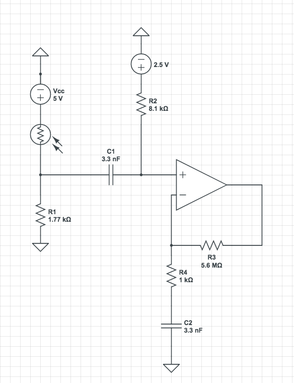
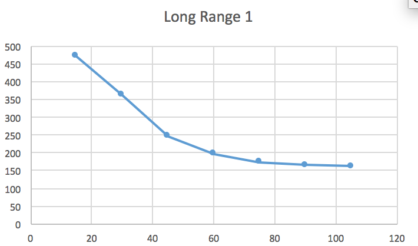
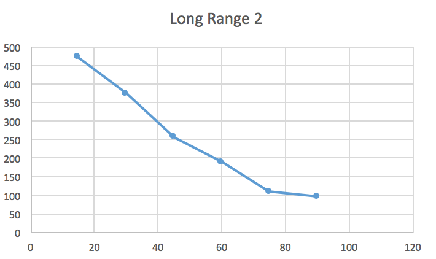

<meta http-equiv="X-UA-Compatible" content="IE=Edge,chrome=1">

# Milestone 2
 
## Treasure Frequency Detection

Materials used:

- breadboard
- wires
- phototransistor
- resistors
- capacitor
- Arduino Uno
- USB serial cable
- oscilloscope
- LM 358 operational amplifier
- treasure


### Analog circuit


We constructed an analog circuit and wrote Arduino code that detects specific frequencies. 

The first stage of implementation was creating an analog circuit that would feed time-domain voltage data to the Arduino Uno. The raw voltage output from the phototransistor upon receiving incident IR radiation has a significant DC component and a relatively small voltage swing. Our goal was to have the Arduino recieve a voltage input between 0 and 5 volts, with large voltage swing. Simply feeding the phototransistor voltage through a noninverting amplifier would amplify the DC component, and render the output signal unusable. Thus, we had to essentially create a high-pass filter at the op-amp input, and then add a DC bias signal to the op-amp output to ensure that the voltage stays within the 0-5v range. We achieved this by constructing the following circuit:



C1 and R2 function as a high-filter to remove the input DC. The 2.5V DC source before R2 is intended to DC-bias the output votlage so that the Arduino can properly read the signal. The theoretical gain of the circuit is roughly 5.5K (1 + R3/R4), though the demonstrated gain is much lower. Note that the actual circuit embedded on the robot will use a voltage divider to implement the 2.5V DC source, not an actual DC voltage source. 

### Arduino code

When developing the Arduino code to detect frequencies, we wanted to ensure that we had robust code that can detect variable frequencies. We also wanted to reduce false-positive and false-negatives. 

The code we developed first generates an array containing the amplitudes of the time-domain signal at frequencies related to the bin index. Afterwards, we call 3 functions that check to see if the given array encodes a 7 kHz, 12 kHz, or 17 kHz signal. Each of the functions for each frequency first computes the "expected bin" where the highest ampitude should be observed. The theory is that if a signal is indeed a 7 kHz, 12 kHz, or 17 kHz signal, then the FFT should have a peak at those frequencies. However, given the imprecision of treasure frequency, combined with the nonlinearities of the circuit, there could be small discrepancies in where the max peak for a given periodic is observed versus where it should be. To address this issue, the function, `detectedFrequency` finds the maximum value within a predefined `peakIndexWidth` of the expected peak. From inspecting the graphs of different signals, we deduced that the maximum amplitude always falls within ~5 bins of where it is expected to be (so the default value for `peakIndexWidth` equals 5). The function iterates through all the FFT values in the array that are within `peakIndexWidth` from the expected max bin. It finds the maximum value contained in this window of bins. The function then checks to see if this maximum value exceeds an absolute threshold, in order to ensure that random noise signals don't produce false positives. If the maximum value fails to exceed an absolute threshold, the function returns `false`, indicating that input signal does not encode a specific frequency. Next, the function checks to see if there are no other bins which contain a value as high as the computed maximum value in the bin window. We don't count bins less than 30, since these correspond to strong DC signals, which are always contained in the input. If the function finds other bins that have values which exceed the value around the expected peak, then the function returns `false`, indicating that the signal is not a periodid signal with the specified frequency. If the input FFT array passes all these checks, then we determine that the signal is a periodic signal of the specified frequency and return `true`. A `true` return value prompts the program to print the frequency value that it has detected. 

We have included the code for this program below:

```
/*
fft_adc_serial.pde
guest openmusiclabs.com 7.7.14
example sketch for testing the fft library.
it takes in data on ADC0 (Analog0) and processes them
with the fft. the data is sent out over the serial
port at 115.2kb.
*/

#define LOG_OUT 1 // use the log output function
#define FFT_N 256 // set to 256 point fft
#include "printf.h"

long clockFreq = 16E6;
int divisionFactor = 32;
int conversionTime = 13;
int numSamples = 256;
float samplingFrequency = ((clockFreq/((float)divisionFactor))/conversionTime);
float binWidth = samplingFrequency/numSamples;

#include <FFT.h> // include the library

void setup() {
  Serial.begin(115200); // use the serial port
  TIMSK0 = 0; // turn off timer0 for lower jitter
  ADCSRA = 0xe5; // set the adc to free running mode
  ADMUX = 0x40; // use adc0
  DIDR0 = 0x01; // turn off the digital input for adc0
  pinMode(13, OUTPUT);
  printf_begin();
}


boolean detectedFrequency(float freqToDetect, char fftArray[]){
  int peakIndexWidth = 5;
  int absoluteMinThreshold = 80;
  int centralBinIndex = int ((float)freqToDetect)/((float)binWidth);
  int maximumMag = -1;
  for (int i = centralBinIndex-peakIndexWidth; i<= centralBinIndex+peakIndexWidth; i++){
    if (abs((int)fftArray[i])>maximumMag){
      maximumMag = abs((int)fftArray[i]);
    }
  }
  if (maximumMag<absoluteMinThreshold){
    return false;
  }
  
  for (int i = 30; i<centralBinIndex-peakIndexWidth; i++){
    if (abs((int)fftArray[i])>= maximumMag){
      return false;
    }
  }
  for (int i = centralBinIndex+peakIndexWidth+1; i<256; i++){
    if (abs((int)fftArray[i])>= maximumMag){
      return false;
    }
  }

  return true;

}


void loop() {
  while(1) { // reduces jitter
    cli();  // UDRE interrupt slows this way down on arduino1.0
    for (int i = 0 ; i < 512 ; i += 2) { // save 256 samples
      while(!(ADCSRA & 0x10)); // wait for adc to be ready
      ADCSRA = 0xf5; // restart adc
      byte m = ADCL; // fetch adc data
      byte j = ADCH;
      int k = (j << 8) | m; // form into an int
      k -= 0x0200; // form into a signed int
      k <<= 6; // form into a 16b signed int
      fft_input[i] = k; // put real data into even bins
      fft_input[i+1] = 0; // set odd bins to 0
    }
    fft_window(); // window the data for better frequency response
    fft_reorder(); // reorder the data before doing the fft
    fft_run(); // process the data in the fft
    fft_mag_log(); // take the output of the fft
    sei();
  
    if (detectedFrequency(7E3, fft_log_out)){
     Serial.print("7kHz \n");

     
    }
     if (detectedFrequency(12E3, fft_log_out)){
     Serial.print("12kHz \n");
     
    }

   if (detectedFrequency(17E3, fft_log_out)){
     Serial.print("17kHz \n");
     
    }
  }
}
```

There's a lot of boilerplate code from the FFT libtary. The function we implemented was `detectedFrequency`. We also added the `if` statements at the end of the `loop` method. 

Here's a video of Evan Kravitz demonstrating the functionality of the circuit and Arduino code:


<video width="460" height="270" controls preload> 
    <source src="resources/Treasure_Detection.mp4"></source> 
</video>


## Distance Sensing

Materials used:

breadboard
wires
long distance sensor
short distance sensor
Arduino Uno
USB serial cable

For this milestone, we implemented distance sensing.  We had two sensor options:  long range and short range.  
We at first decided that we wanted to try to use a combination of both sensors, as the short range would detect 
walls up close and tell the robot to turn to avoid collision, and the long range would allow for faster mapping.  
 
We tested the short range sensor first.  We wired up a simple circuit consisting of the distance sensor and the
Arduino and wrote simple code to display the values outputted from the distance sensor when the block of wood 
was located at different distances away.  We recorded data for the short range sensor when the block of wood was 
located in 5 cm intervals from 5 cm to 35 cm away, within the range of the specifications of the sensor we found 
online.  We found that the specifications for the short range sensor online were consistent with the data we 
recorded, a graph of which is shown below.

 
We then did the same test for the long range sensors, and found that the results were not as predictable. We 
realized that the sensors were transmitting a signal in a wide cone and were therefore detecting objects around 
the room that were not relevant.  This is the data we got from two subsequent trials for the long range sensors. 


 
 
We decided that because the long range sensors were more unpredictable, and because we thought the short range 
sensors would be able to more accurately predict when the robot was approaching a wall, we would implement
wall detection using short range sensors. 
Our code for this is shown below:
 
```int value=0; 

void setup() {
  // put your setup code here, to run once:
  Serial.begin(9600); 
  pinMode(A0,INPUT);
}

void loop() {
  // put your main code here, to run repeatedly:
  value= analogRead(A0); 
  if (value>150){ // this would be a little bit closer than 15 cm to any wall.
    //stop at junction 
    //turn at junction 
  } else {
   //go straight
  }
  delay(500);
}
```
