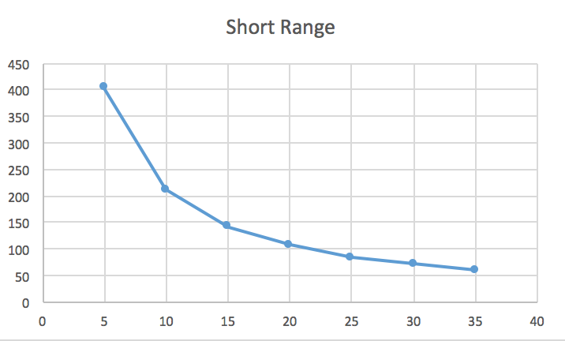

# Milestone 2
 
## Treasure Detection

<a href="http://www.youtube.com/watch?feature=player_embedded&v=w5iABs7IJ5A
" target="_blank"></a>

## Distance Sensing

For this milestone, we implemented distance sensing.  We had two sensor options:  long range and short range.  
We at first decided that we wanted to try to use a combination of both sensors, as the short range would detect 
walls up close and tell the robot to turn to avoid collision, and the long range would allow for faster mapping.  
 
We tested the short range sensor first.  We wired up a simple circuit consisting of the distance sensor and the
Arduino and wrote simple code to display the values outputted from the distance sensor when the block of wood 
was located at different distances away.  We recorded data for the short range sensor when the block of wood was 
located in 5 cm intervals from 5 cm to 35 cm away, within the range of the specifications of the sensor we found 
online.  We found that the specifications for the short range sensor online were consistent with the data we 
recorded, a graph of which is shown below.

 
We then did the same test for the long range sensors, and found that the results were not as predictable. We 
realized that the sensors were transmitting a signal in a wide cone and were therefore detecting objects around 
the room that were not relevant.  This is the data we got from two subsequent trials for the long range sensors. 


 
 
We decided that because the long range sensors were more unpredictable, and because we thought the short range 
sensors would be able to more accurately predict when the robot was approaching a wall, we decided to implement
wall detection using short range sensors. 
Our code for this is shown below:
 
```int value=0; 

void setup() {
  // put your setup code here, to run once:
  Serial.begin(9600); 
  pinMode(A0,INPUT);
}

void loop() {
  // put your main code here, to run repeatedly:
  value= analogRead(A0); 
  if (value>150){ // this would be a little bit closer than 15 cm to any wall.
    //stop at junction 
    //turn at junction 
  } else {
   //go straight WE HAVE TO IMPLEMENT THIS PART 
  }
  delay(500);
}
```
