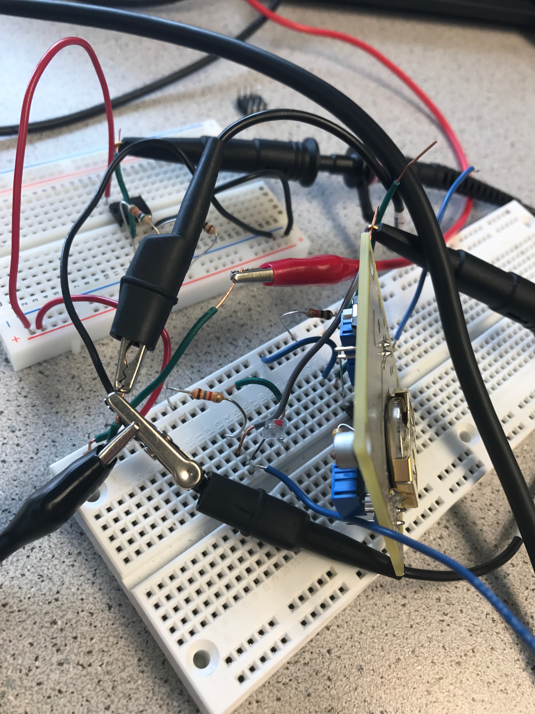
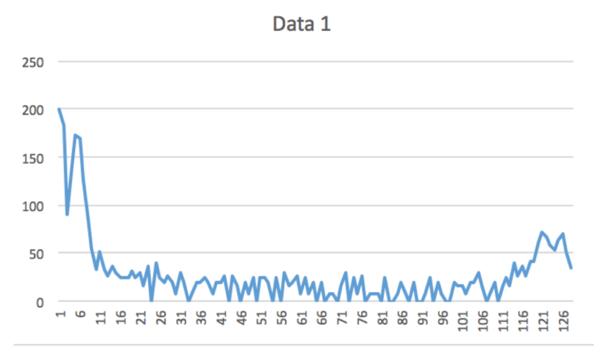
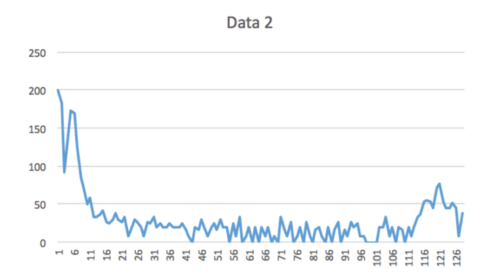

<meta http-equiv="X-UA-Compatible" content="IE=Edge,chrome=1">
# Lab 2

## Optical Team -- IR Circuit

Materials used:

- breadboard
- wires
- phototransistor
- 1.78 kΩ resistor
- Arduino Uno
- USB serial cable
- oscilloscope

For this component of the lab, we constructed a circuit that is able to detect electromagnetic radiation of infrared (IR) frequncy. A photo transistor was used to modulate the circuit in response to a 7 kHz pulsating IR light. The phototransistor works via an embedded bipolar junction transistor, which is able to pass current in response to incident electromagnetic radiation. The changing current causes voltage to drop across the serial resistor. We measured the voltage at the terminal of the resistor with an oscilloscope. The amplitude of the voltage recorded was around 100 mV. This voltage was directly connected to an analog pin of the Arduino Uno with a wire.

Below is a photograph of the oscilloscope depicting the sinusoidal voltage signal generated from the phototransistor. 

We've also included a photo of the circuit:

We then used the standard `fft` library to process the voltage signal. The Arduino has built-in hardware capable of processing the signal using the ADC (analog-to-digital) converter, which performs better than the regular `analogRead` function for high frequency data.

The data was then transformed into the frequency-domain using the `fft` library. FFT--or Fast Fourier Transform--is a method used by computers to efficiently convert time-domain data into the frequency domain. We utilized the `fft_adc_serial` script to output a serial stream of frequency data. The `fft` takes advantage of the analog-to-digital converter. Each serial line of output corresponds to the amplitude of the input signal at a frequency related to the relative index of the line output. Each index corresponds to an integer multiple of the sampling frequency, so index *i* corresponds to frequency *fsi*, where *fs* is the sampling frequency. 

In order to make sense of the FFT data, we needed to figure out the sampling frequency. Using the data sheet, we deduced that the sampling frequency, *fs*, is roughly 150 Hz. 

After gathering the FFT serial data, we plotted the data in MATLAB. Included below is a MATLAB plot we generated from the data:

Since the sampling frequency is 150 Hz, and the pulsating frequency of the IR signal is  7 kHz, we should see high ampilitude around bin index 46. The MATLAB plot clearly shows this feature at around that index value, demonstrating that the Arduino can detect IR signals.

For future developments, we plan to use analog filtering to enhance the quality of the FFT data. In addition, to ensure that low intensity IR radiation can be detected, we plan to incorporate some sort of analog amplifier. We tried to use an op-amp to achieve this task for this lab, but were unable to get the circuit to perform properly. 

## Acoustic Team: 

In this part of the lab, we built a microphone circuit and wrote code so that our Arduino would be able to detect a tone of 660 Hz, the frequency that will be generated in the beep that signals the robot should start navigating the maze.
 
### Testing:
Before we got to lab, we went onto the Open Music Lab’s website and downloaded the FFT library.  Before we built our microphone circuit, we wanted to test what the code was doing.  We opened the example script from the FFT library named fft_adc_serial, and tested the code using an oscilloscope and function generator with parameters of 660 Hz, 3.3V/2 Vpp, and a 0.825V offset.  We then recorded the data using the Arduino’s Serial Monitor, and plotted the results using excel.  Graphs from two subsequent trials are shown below: 

Our peak voltage for every trial we ran occurred at the 5th data point.  We computed expected peak voltage as follows: 9600 Hz sampling frequency / 256 data points = 37.5 Hz/ point.  By this logic, the 660 Hz frequency peak should have occurred around the 17th data point, because 660 Hz/ 37.5 = 17.6.  We concluded that we must be sampling at a higher frequency than 9600 Hz.  In fact, our math suggests that we are actually sampling at a frequency of around 40,000 Hz.  40,000 Hz/ 256 data points= 156.25 Hz/ data point.  5th point * 156.25 Hz/ data point= 781.25 Hz.  4th point *156.25 Hz/ data point = 625 Hz.  So a frequency of 660 Hz would indeed occur in the 5th bin and at the 5th point if our system was being sampled at a rate of 40 kHz. 

### Building the circuit:
After we got this initial data, we started building our microphone circuit.  The figure below shows the schematic of the circuit we went off from the course website.

And here's what our microphone circuit looked like: 

Once we built the circuit, we checked to see if it was working as expected.  We found a free online tone generator as shown below.  We then played the tone off a computer next to the circuit and observed the results using an oscilloscope.  The oscilloscope showed that it was taking in data from the acoustics in the room, and generating a wave of frequency 660 Hz when the tone was played next to the circuit, as shown in the photo of the oscilloscope screen below.

From there, we fed the microphone output to the Arduino and wrote to the Arduino to check for spikes in bin 5, where the start signal of 660 hz would appear if detected by the microphone: 

To visually demonstrate the Arduino's ability to detect the start signal, we had it light up an LED once the microphone detected it. The start function would typically begin line detection, make the robot's wheels subsequently turn, and so on. Below is a video of the arduino LED responding to a 660 hz signal: 
<video width="450" height="270" controls preload> 
    <source src="IMG_0198.mp4"></source> 
</video>

At this point we were pleased with our results.  We realize that in the future, the tone may not be as loud as it was when it was played off a computer, and so we started building a simple Non-inverting Op Amp circuit to amplify the signal from the microphone.  The schematic we were going off is shown in a picture below:  

We did not implement this amplifier in this part of the lab, but we have built the amplifier and are ready to use it if we discover that it becomes necessary down the line.    
